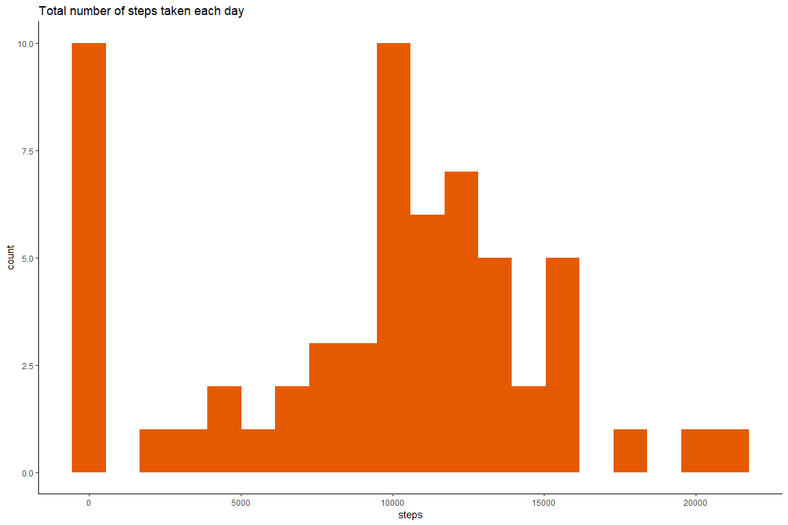
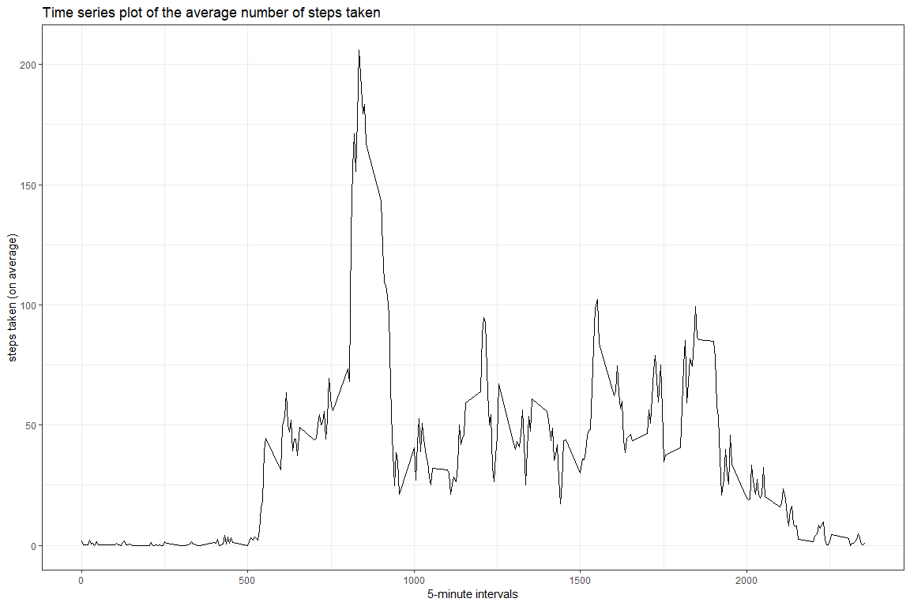
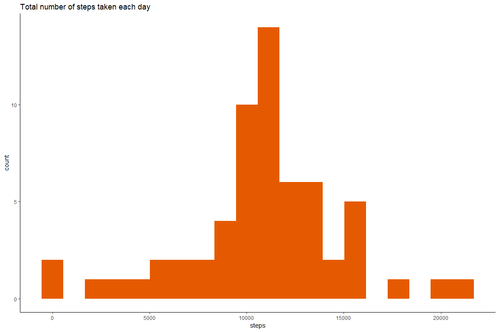
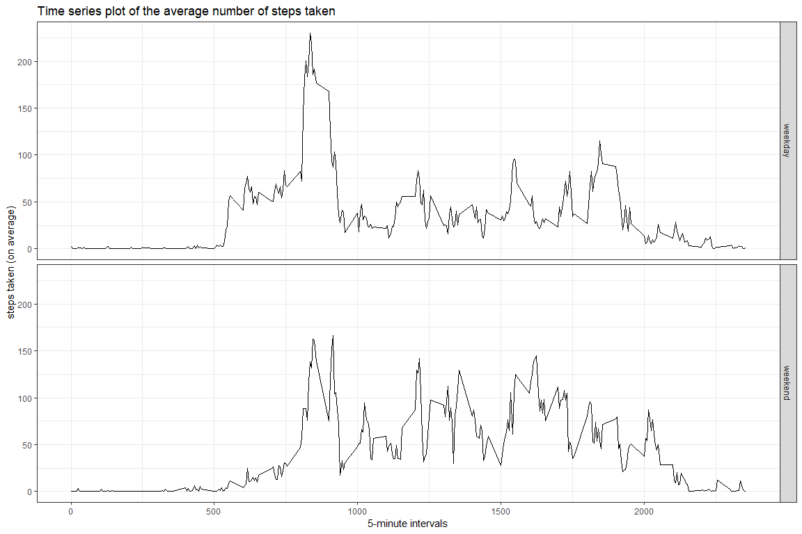

Prior to the actual project we need to set up global options, assign timezone, clear the environment, load necessary packages and set working directory:


```r
knitr::opts_chunk$set(echo = TRUE,
                      fig.width = 12,
                      fig.height = 8,
                      warning = FALSE,
                      message = FALSE)
Sys.setenv(TZ = "UTC")
Sys.setlocale("LC_ALL","English")
rm(list = ls())
library(tidyverse)
library(knitr)
setwd("C:/r/coursera/")
```
## Loading and preprocessing the data
First, we will download the data, unzip it and prepare it for plotting

```r
url <- paste0("https://d396qusza40orc.",
              "cloudfront.net/repdata%2Fdata%2Factivity.zip")
download.file(url, "steps.zip")
unzip("steps.zip")

# initial data + new factor variable:
df <- read_csv("activity.csv") %>% 
        mutate(day = factor(ifelse(weekdays(date) %in% c("Saturday", "Sunday"),
                                   "weekend",
                                   "weekday")))

# we'll need this dataset for time series plot:
intervals <- df %>%
        group_by(interval) %>%
        summarise(average = mean(steps, na.rm = TRUE))

# this is for imputation:
df <- df %>%
        left_join(., intervals)
```
## What is mean total number of steps taken per day?
1. Histogram of the total number of steps taken each day:

```r
# preparing dataset for questions 2 and 3:
steps <- df %>%
        group_by(date) %>%
        summarise(total = sum(steps, na.rm = TRUE))

# 1. Make a histogram of the total number of steps taken each day:
ggplot(steps, aes(x = total))+
        geom_histogram(bins = 20, fill = "#E55A00")+
        ggtitle("Total number of steps taken each day")+
        xlab("steps")+
    theme_classic()
```

<!-- -->

```r
# 2. Calculate and report the mean and median total number of steps taken per day:
cat("mean = ", with(steps, mean(total, na.rm = TRUE)))
```

```
## mean =  9354.23
```

```r
cat("median = ", with(steps, median(total, na.rm = TRUE)))
```

```
## median =  10395
```
## What is the average daily activity pattern?

```r
# 1. Make a time series plot...:
ggplot(intervals, aes(x = interval, y = average))+
        geom_line()+
        labs(title = "Time series plot of the average number of steps taken",
             x = "5-minute intervals",
             y = "steps taken (on average)")+
        theme_bw()
```

<!-- -->

```r
# 2. Max 5-min interval:
intervals$interval[which.max(intervals$average)]
```

```
## [1] 835
```
## Imputing missing values

```r
# 1. The total number of rows with NAs:
sum(apply(df, 1, anyNA))
```

```
## [1] 2304
```

```r
# 2. Devise a strategy for filling in NAs:
# (I would use an average for that 5-min interval)
# 3. Create new dataset with imputed NAs:
newdf <- df %>%
        mutate_at(vars(steps), ~if_else(is.na(steps), average, .))
# 4. Make a histogram of the total number of steps...:
newsteps <- newdf %>%
        group_by(date) %>%
        summarise(total = sum(steps))

ggplot(newsteps, aes(x = total))+
        geom_histogram(bins = 20, fill = "#E55A00")+
        ggtitle("Total number of steps taken each day")+
        xlab("steps")+
    theme_classic()
```

<!-- -->
As it can be seen from the previous plots, new values differ from the estimates from the first part of the assignment. The process of imputation shifted the overall bulk of cases towards the center of the graph.  

## Are there differences in activity patterns between weekdays and weekends?

```r
# Make a panel plot...:
newintervals <- newdf %>%
        group_by(interval, day) %>%
        summarise(average = mean(steps))

ggplot(newintervals, aes(x = interval, y = average))+
        geom_line()+
        labs(title = "Time series plot of the average number of steps taken",
             x = "5-minute intervals",
             y = "steps taken (on average)")+
        facet_grid(day ~ .)+
        theme_bw()
```

<!-- -->
